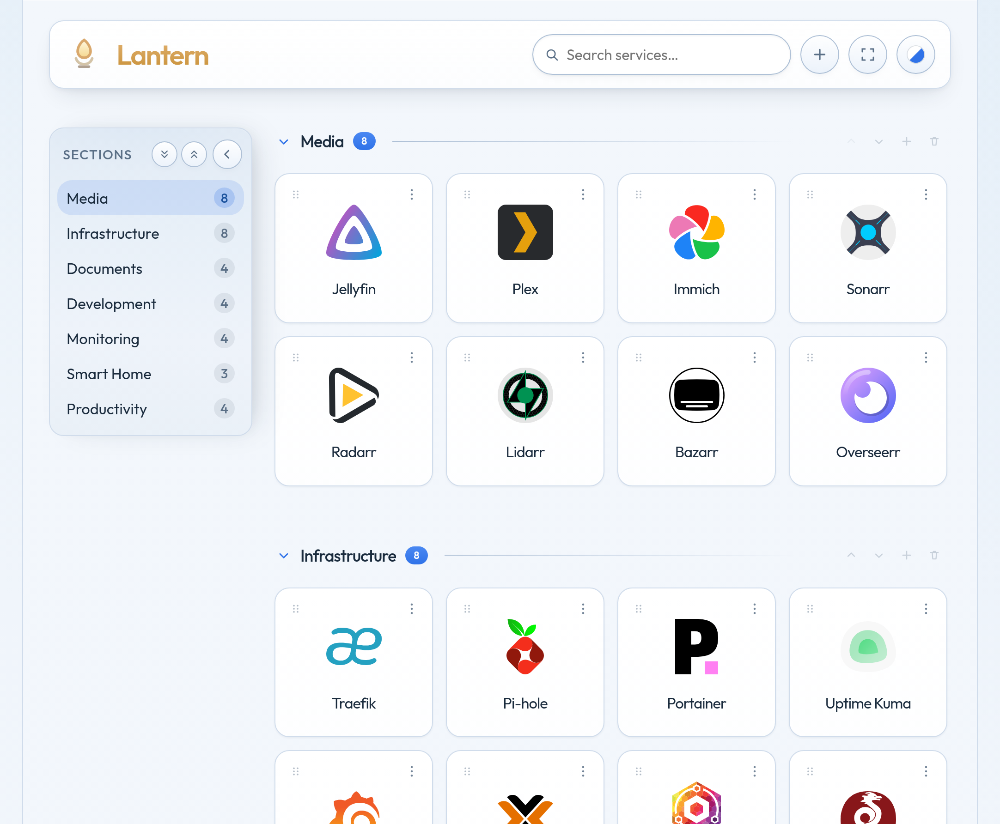
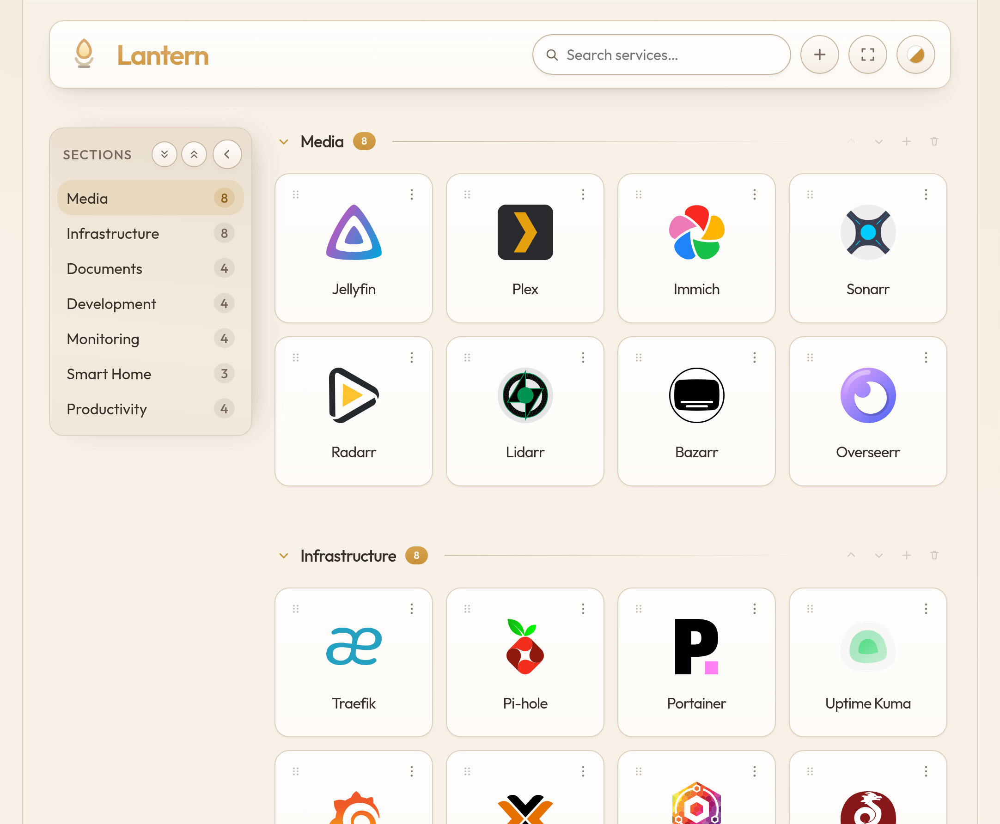
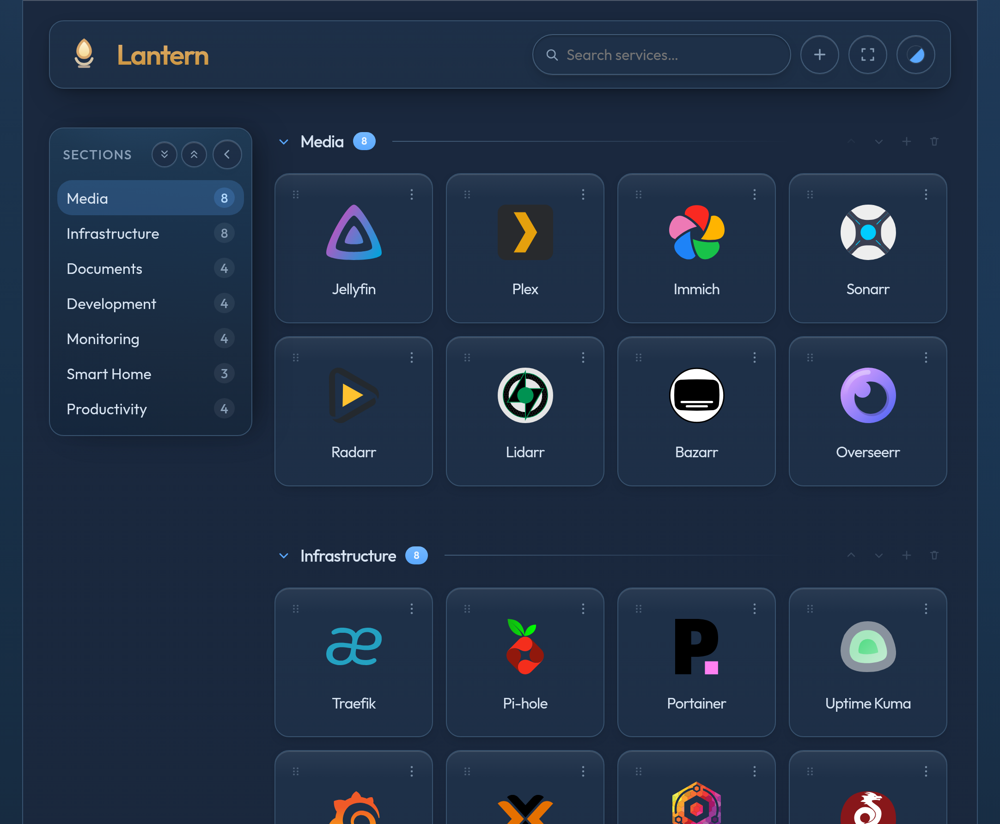
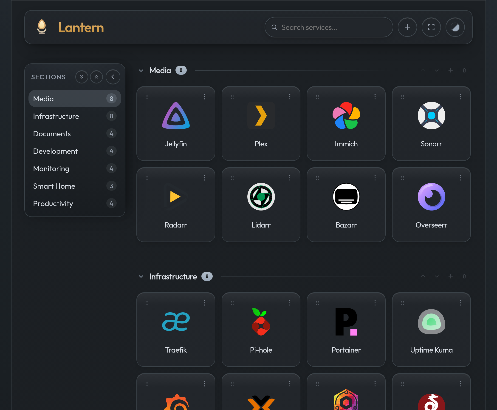

# Lantern

A lightweight start page for self-hosted services. Configure links in a JSON file, get automatic icons, and manage tiles from the browser.

<p align="center">
  
  
</p>
<p align="center">
  
  
</p>

## About

Lantern is a small Go web app that turns a JSON config into a dashboard of service tiles grouped by section. It is designed for homelabs and self-hosted setups where you want a single landing page for Traefik, Pi-hole, media servers, and everything else on your network.

**What it does:**

- Renders sections and clickable tiles from `config.json`
- Resolves icons automatically ([Dashboard Icons](https://dashboardicons.com), page favicon, [Simple Icons](https://simpleicons.org/), or a custom upload)
- Lets you add, edit, and remove sections and tiles in the UI
- Provides search and multiple color themes
- Ships as a minimal distroless Docker image
- Supports hot-reload in development via [Air](https://github.com/air-verse/air)

**What it does not do:**

- No authentication or multi-user access control (put it behind your reverse proxy or VPN)
- No database — configuration is a single JSON file on disk

## How to use

### First-time setup

1. Copy the example config:

   ```bash
   cp config.json.example config.json
   ```

2. Edit `config.json` and add your services:

   ```json
   {
     "title": "Lantern",
     "sections": [
       {
         "name": "Infrastructure",
         "items": [
           {
             "name": "Traefik",
             "url": "https://traefik.example.com"
           }
         ]
       }
     ]
   }
   ```

3. Start Lantern (see [Running](#running) below) and open it in your browser.

### Dashboard

- **Search** — filter tiles by name in the header search box
- **Themes** — pick a color scheme from the theme menu (stored in your browser)
- **Add section** — create a new group of tiles
- **Tile menu** (⋯) — edit or delete a tile
- **Section menu** — rename or delete a section, add a tile to it

Changes made in the UI are written back to `config.json` on the server.

### Icons

Lantern looks up a color icon from [Dashboard Icons](https://dashboardicons.com) using the tile name, then the service favicon, then [Simple Icons](https://simpleicons.org/). Upload a custom image in the tile editor to override it. The reload button on the preview fetches the automatic icon again.

### Environment variables

| Variable | Default | Description |
|----------|---------|-------------|
| `CONFIG_PATH` | `/config/config.json` | Path to the JSON config file |
| `CACHE_DIR` | `/data/cache` | Icon cache directory |
| `LISTEN` | `:8080` | HTTP listen address |

## Running

### Docker (quick start)

```bash
cp config.json.example config.json
# edit config.json

docker run -d \
  --name lantern \
  -p 8080:8080 \
  -v "$(pwd)/config.json:/config/config.json" \
  -v lantern-data:/data \
  ghcr.io/artyum/lantern:latest
```

Open `http://localhost:8080`.

### Docker Compose (production)

For Traefik or another reverse proxy, use [`deploy/docker-compose.prod.yml`](deploy/docker-compose.prod.yml):

```bash
cp config.json.example deploy/config.json
cp deploy/.env.prod.example deploy/.env.prod
```

Edit `deploy/.env.prod`:

```env
LANTERN_IMAGE=ghcr.io/artyum/lantern:latest
LANTERN_HOST=lantern.example.com
```

Start:

```bash
docker compose --env-file deploy/.env.prod -f deploy/docker-compose.prod.yml up -d
```

Production volumes are relative to `deploy/`: `config.json` and `mount/data/` (icon cache).

### Pre-built images (GHCR)

CI builds and publishes images on every push to `main` and on `v*` tags:

```
ghcr.io/artyum/lantern:latest
ghcr.io/artyum/lantern:<sha>
ghcr.io/artyum/lantern:v1.0.0
```

To make the package public: GitHub → **Packages** → **lantern** → **Package settings** → **Change visibility**.

## Development

### Requirements

- Docker with Compose v2
- Optional: Go 1.27+ for running tests outside Docker
- Optional: external Docker network `traefik-net` if you use the Traefik labels in dev compose

### Setup

```bash
cp config.json.example config.json
cp deploy/.env.dev.example deploy/.env.dev
```

Create the Traefik network if you need it:

```bash
docker network create traefik-net
```

### Dev workflow

The dev container mounts the source tree and runs Air for hot-reload on Go, HTML, CSS, and JS changes.

| Script | Description |
|--------|-------------|
| `./build_app.sh` | Build the dev image and start the container |
| `./start_app.sh` | Start the dev container (if already built) |
| `./stop_app.sh` | Stop the dev container |
| `./restart_app.sh` | Restart the dev container |
| `./docker_logs.sh` | Follow container logs |
| `./deploy/build.sh` | Build dev image only |
| `./deploy/build.sh prod` | Build production image locally as `lantern:local` |
| `./run_tests.sh` | Run `go test ./...` |
| `./run_lint_check.sh` | Run gofmt, go vet, and tests |
| `./run_audit.sh` | Run govulncheck (+ optional Trivy on local image) |

Typical flow:

```bash
./build_app.sh          # first run: build + start
# edit code — Air reloads automatically
./stop_app.sh           # when done
```

Dev compose file: [`deploy/docker-compose.dev.yml`](deploy/docker-compose.dev.yml).  
Dev volumes use paths relative to the repo root (`../config.json`, `../mount/`).  
By default the app is exposed through Traefik at `lantern.lan`; adjust labels or publish port `8080` if needed.

### Run without Docker

```bash
export CONFIG_PATH=./config.json
export CACHE_DIR=./data/cache
export LISTEN=:8080
go run ./cmd/lantern
```

## API

| Method | Path | Description |
|--------|------|-------------|
| `GET` | `/healthz` | Health check |
| `GET` | `/api/config` | Current configuration |
| `POST` | `/api/section` | Add a section |
| `DELETE` | `/api/section` | Delete a section |
| `POST` | `/api/item` | Add a tile |
| `PUT` | `/api/item` | Update a tile |
| `DELETE` | `/api/item` | Delete a tile |
| `GET` | `/icons/{key}` | Tile icon |

## License

[MIT](LICENSE)
